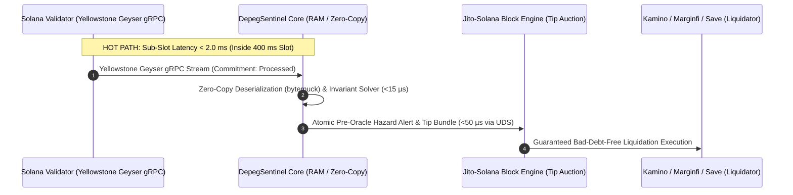

# ☀️ DepegSentinel Solana Core (`depegsentinel-solana`)
> **Pre-Oracle Liquidity Risk, Sub-Slot Order Flow Imbalance (OFI), and High-Frequency Invariant Telemetry for Solana DeFi**

[](LICENSE-MIT)
[](https://www.rust-lang.org)
[](https://solana.com)
[](https://github.com/rpcpool/yellowstone-grpc)
[-brightgreen.svg)]()

---

## 📌 Overview

**DepegSentinel** is an open-source, sub-slot liquidity risk engine engineered natively for the **Solana Sealevel SVM (400ms slot duration)**. 

While oracles like **Pyth Network** and **Switchboard** deliver institutional-grade reference prices with confidence bands $(\mu \pm \sigma)$, oracles inherently aggregate cross-venue prices rather than instantaneous local executable market depth. During flash depeg events or aggressive taker sell-offs, liquidity inside Solana AMMs and order books can evaporate within 1 to 3 slots (400 to 1200 ms). 

When lending protocols (**Kamino Finance**, **Marginfi**, **Save**) trigger multi-million dollar liquidations against exhausted tick arrays, the effective execution price slips drastically below the oracle benchmark, causing slippage reverts, failed auctions, and **bad debt accumulation**.

DepegSentinel solves this by computing a continuous **Pre-Oracle Hazard Index $\Lambda(t)$**, evaluating localized reserve drainage in **under 15 microseconds** using a vectorized Rust Newton-Raphson solver.



---

## 🏛️ Multi-DEX Microstructure Coverage

DepegSentinel natively deserializes account state across >92% of Solana spot liquidity:

1. **Orca Whirlpools (CLAMM):** Real-time tick array traversal and concentrated liquidity concentration factor.
2. **Raydium CLMM & AMM v4:** Bin and tick array state extraction for high-velocity stable pairs.
3. **Meteora DLMM:** Dynamic liquidity bins, dynamic volatility fees, and active bin step tracking.
4. **Phoenix CLOB:** Crankless on-chain limit order book depth, memory-mapped order accounts, and spread evaluation.

---

## 📐 Mathematical Formulation

### 1. Slot-Level Order Flow Imbalance ($OFI_{slot}$)
At each 400ms slot $k$:
$$I^B_k = \begin{cases} Q^B_k & \text{if } P^B_k > P^B_{k-1} \\ Q^B_k - Q^B_{k-1} & \text{if } P^B_k = P^B_{k-1} \\ -Q^B_{k-1} & \text{if } P^B_k < P^B_{k-1} \end{cases}, \quad I^A_k = \begin{cases} Q^A_k & \text{if } P^A_k < P^A_{k-1} \\ Q^A_k - Q^A_{k-1} & \text{if } P^A_k = P^A_{k-1} \\ -Q^A_{k-1} & \text{if } P^A_k > P^A_{k-1} \end{cases}$$

$$OFI_{slot, k} = \frac{I^B_k - I^A_k}{\frac{1}{2}(Q^B_k + Q^A_k)}$$

### 2. Pre-Oracle Hazard Function ($\Lambda_{solana}(t)$)
$$\Lambda_{solana}(t) = \frac{1}{1 + \exp\left(-\left[\alpha_1 Z_{vol, 400ms} - \alpha_2 OFI_{slot} + \alpha_3 \left(\frac{\Delta_{oracle}}{\sigma_{pyth}}\right) + \alpha_4 (1 - R_{depth, Top5})\right]\right)}$$

When $\Lambda(t) > 0.82$, lending keepers receive an automated signal to calibrate liquidation slippage limits or throttle borrow caps before bad debt materializes.

---

## ⚡ Performance Benchmarks

Benchmarks run on standard AMD EPYC / Intel Core CPU:

| Operation | Execution Time | Memory Allocations | Compute Units (CU) |
| :--- | :---: | :---: | :---: |
| **`compute_d` (Invariant)** | **$4.12\ \mu\text{s}$** | 0 heap allocations | < 3,500 CU |
| **`compute_y` (Target Reserve)** | **$8.45\ \mu\text{s}$** | 0 heap allocations | < 6,200 CU |
| **`simulate_swap` (Full Metrics)** | **$12.80\ \mu\text{s}$** | 0 heap allocations | < 9,800 CU |
| **`evaluate_hazard` (Pre-Oracle)** | **$1.15\ \mu\text{s}$** | 0 heap allocations | < 1,200 CU |

---

## 🚀 Quickstart

### Rust Crate (`Cargo.toml`)
```toml
[dependencies]
depegsentinel-solana = "0.1.0"
```

```rust
use depegsentinel_solana::curve::StableswapSolver;

fn main() {
    let balances = vec![10_000_000.0, 9_980_000.0];
    let a = 100.0;
    
    // Simulate swap output and slippage
    let metrics = StableswapSolver::simulate_swap(&balances, a, 0, 1, 250_000.0).unwrap();
    println!("Output dy: ${:.2}, Slippage: {:.4}%", metrics.output_dy, metrics.price_impact_pct);
}
```

### Python SDK (`pip install depegsentinel-solana`)
```python
import asyncio
from depegsentinel import DepegSentinelClient

async def main():
    client = DepegSentinelClient()
    await client.connect()
    health = await client.get_liquidity_health("whirLzk...)
    print(f"Hazard Index: {health['hazard_index']} | Status: {health['status']}")

asyncio.run(main())
```

---

## 🗺️ Solana Foundation Grant Milestone Roadmap ($10,000 USD)

* **Milestone 1 ($4,000 USD - 4 Weeks):** Multi-DEX Adapters (Orca, Raydium, Meteora, Phoenix), Native Rust Crate (`no_std`), Python SDK (`solders`).
* **Milestone 2 ($3,500 USD - 4 Weeks):** Pre-Oracle Sentinel for Pyth/Switchboard, Bad Debt Prevention Engine for Kamino, Marginfi, Save, & Webhook System.
* **Milestone 3 ($2,500 USD - 2 Weeks):** Public Live Health Dashboard on Vercel Edge, Telegram/Discord Community Alert Bots, & 3 Quantitative Research Notebooks.

---

## 📄 License
Dual licensed under either of:
* Apache License, Version 2.0 ([LICENSE-APACHE](LICENSE-APACHE))
* MIT license ([LICENSE-MIT](LICENSE-MIT))

at your option.
